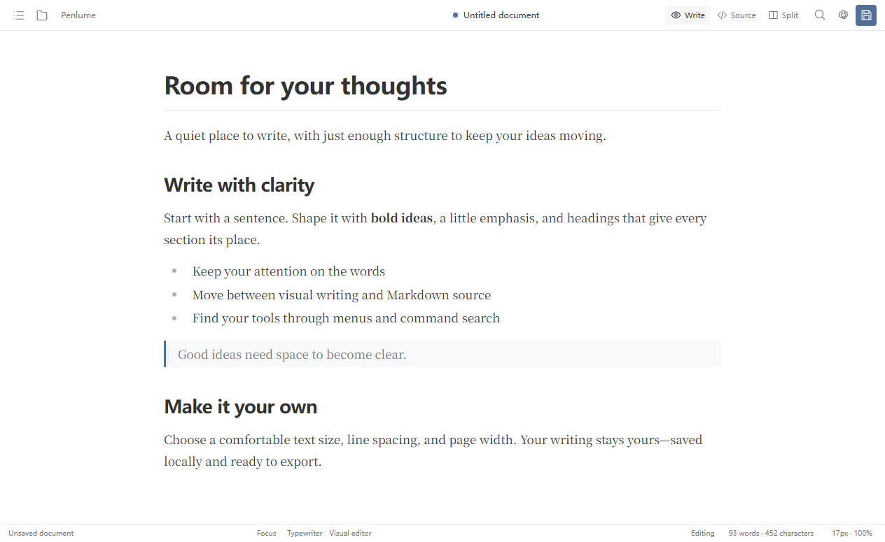
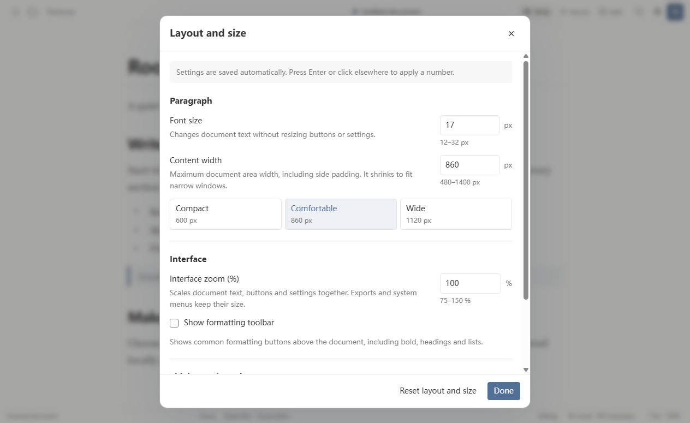

<p align="center"></p>
<h1 align="center">Penlume</h1>
<p align="center"><strong>A quiet place to write.</strong><br>让文字成为主角的 Markdown 桌面编辑器。</p>
<p align="center"><a href="LICENSE"></a>  <a href="https://github.com/scramers/Penlume/releases"></a></p>
<p align="center"><strong>简体中文</strong> · <a href="README.en.md">English</a><br><a href="https://github.com/scramers/Penlume/releases">版本发布</a> · <a href="docs/DEVELOPMENT.md">开发指南</a> · <a href="CONTRIBUTING.md">参与贡献</a> · <a href="https://github.com/scramers/Penlume/issues">反馈问题</a></p>

Penlume 是一个本地优先的 Markdown 编辑器，适合写笔记、技术文档和长文章。你可以直接在排版后的正文中写作，也可以切换到源码，或同时查看源码与预览。文档保存在你选择的本地文件夹中，日常写作无需账号。



## 你可以用它做什么

| 写作场景 | 已有能力 |
| --- | --- |
| 安静地写一篇文章 | 简洁写作界面、专注模式、打字机模式、字数统计和写作目标 |
| 整理一组文档 | 多文档标签、文件树、大纲、快速打开、文件夹全文搜索和最近项目 |
| 高效编辑内容 | 格式快捷键、查找替换、命令搜索、跨视图撤销与重做、选区复制为 Markdown / HTML / 纯文本 |
| 编写技术文档 | GFM 表格、任务列表、脚注、LaTeX 公式、Mermaid 图表、代码高亮和文档信息（Front Matter） |
| 管理图片与媒体 | 粘贴或拖入图片、本地资源目录、图片缩放与描述、资源引用检查、本地音视频 |
| 调整阅读与写作外观 | 明暗主题、8 款内置主题、中英文界面、字体和行高、自定义 CSS、可拖动面板 |
| 交付与交换文档 | HTML、PDF、PNG 导出；通过 Pandoc 导入或导出 Word、EPUB、ODT、RTF、LaTeX 等格式 |
| 保护本地修改 | 未保存提醒、恢复草稿、外部修改冲突检查、同目录临时文件与原子替换保存 |

## 开始使用

当前已验证 **Windows x64**，版本为 **0.12.1**。从 [Releases](https://github.com/scramers/Penlume/releases) 下载 **Core Setup** 安装版或 **Core Portable** 单文件便携版。

Core 版包含编辑器与 HTML / PDF / PNG 导出，不捆绑 Pandoc。需要 Word / EPUB 等转换时，先[安装官方 Pandoc](https://pandoc.org/installing.html)，再在偏好设置中指定其路径，或让程序从系统 PATH 检测。Windows 程序尚未数字签名。

打开程序后，按 `Ctrl+N` 新建文档，或按 `Ctrl+O` 打开已有 Markdown。顶部的“写作 / 源码 / 并排”切换编辑方式。按 `Ctrl+K` 搜索命令，可以找到格式、复制、导出和布局操作。

### 把大小调到舒服的位置

点击顶部的布局按钮或底部尺寸读数，可集中调整布局。三个设置分别控制：

| 设置 | 用途 |
| --- | --- |
| 正文字号 | 只调整文档文字，范围 12–32 px；不改变按钮与设置面板 |
| 正文最大宽度 | 调整正文区域的最大宽度，包含左右留白；窄窗口会自动收缩 |
| 界面缩放 | 按 75–150% 缩放正文和界面控件；不改变导出大小与系统菜单 |

拖动侧栏边缘或源码与预览之间的分隔线，可以调整面板比例。小窗口下，侧栏改为覆盖显示，源码与预览改为上下排列。设置会自动保存；不满意时可恢复默认尺寸。



### 常用快捷键

| 操作 | Windows 快捷键 |
| --- | --- |
| 新建 / 打开 / 保存 | `Ctrl+N` / `Ctrl+O` / `Ctrl+S` |
| 查找 / 替换 | `Ctrl+F` / `Ctrl+H` |
| 搜索命令 | `Ctrl+K` |
| 粗体 / 斜体 / 行内代码 | `Ctrl+B` / `Ctrl+I` / `Ctrl+E` |
| 撤销 / 重做 | `Ctrl+Z` / `Ctrl+Y` |
| 切换源码 / 并排预览 | `Ctrl+/` / `Ctrl+Shift+V` |
| 选区复制为 Markdown / 纯文本 | `Ctrl+Shift+C` / `Ctrl+Alt+C` |
| 切换侧栏 / 专注 / 打字机模式 | `Ctrl+Shift+L` / `F8` / `F9` |
| 正文字号增大 / 减小 / 重置 | `Ctrl+Alt+=` / `Ctrl+Alt+-` / `Ctrl+Alt+0` |
| 界面放大 / 缩小 / 重置 | `Ctrl+=` / `Ctrl+-` / `Ctrl+0` |

复制为 HTML 可从“编辑”菜单或命令搜索进入。表格矩形选区使用普通 `Ctrl+C`；部分跨单元格、跨块等复杂选区暂不支持指定格式复制。

## 本地文件与隐私

Markdown 文件保存在你选择的路径，应用不会把它们锁进专用数据库。设置、会话和恢复草稿保存在本机应用数据目录；恢复草稿不能代替日常备份。

默认无需登录，不上传文档、不发送遥测。打开、编辑、保存和已准备好的 Pandoc 转换可以离线完成。文档中的远程图片、外部链接，以及你主动配置并执行的图片上传工具，可能访问网络。

项目原名 **TTypora**。为兼容已有设置、会话与草稿，部分内部标识和数据目录仍沿用 `ttypora`；界面与产品名为 Penlume。

## 从源码运行

准备 Git、**Node.js 22.12+** 和 npm：

```bash
git clone https://github.com/scramers/Penlume.git
cd Penlume
npm ci
npm run dev
```

首次安装会下载依赖和 Electron。开发服务器仅用于源码开发；发布程序直接运行桌面应用。

```bash
npm run typecheck   # TypeScript 检查
npm test            # 单元测试
npm run build       # 构建桌面程序
```

Windows 转换功能与打包需要先准备 Pandoc；脚本从官方发布下载固定版本，并核对 SHA-256：

```powershell
npm run setup:pandoc:win
npm run package:win           # 安装版
npm run package:portable:win  # 单文件便携版
# 不捆绑 Pandoc 的公开发行版本
npm run package:core:win
```

`.tools/`、依赖、个人数据、构建输出和验收日志不入 Git。完整架构、桌面测试和打包说明见 [开发指南](docs/DEVELOPMENT.md)。

## 当前阶段与验证

Penlume 正在持续完善。0.12.1 的本地验收通过类型检查、构建、**1,138 项单元测试**，以及最终 Windows 程序的 8 项检查，覆盖排版、布局、导出、中英文界面、基本桌面流程、选区复制、编辑历史与便携版启动。

这些结果不代表 macOS / Linux、所有输入法和系统安装升级均已验证。复杂选区、超长文档与高级转换仍有边界；Windows 构建尚未数字签名。项目没有完成与 Typora 的全面对比，也不宣称已经全面超过 Typora。

- [0.12.1 更新与验证范围](docs/PRODUCTION_V0.12.1.md)
- [已实现功能与剩余工作](docs/IMPLEMENTATION_STATUS.md)
- [Markdown 兼容策略](docs/MARKDOWN_COMPATIBILITY.md)
- [文件保存与冲突策略](docs/FILE_SAFETY.md)

历史版本记录中的 `artifacts/` 路径指向维护者的本地验收产物，不是仓库中的下载链接。

## 参与贡献

欢迎提交可复现的问题、实际写作场景、界面建议和 Pull Request。提交问题时，请附版本、操作步骤和最小 Markdown 示例，并移除个人信息。贡献流程见 [CONTRIBUTING.md](CONTRIBUTING.md)。

## 许可证与致谢

Penlume 原创代码与文档采用 [MIT 许可证](LICENSE)。第三方代码、数据和随构建使用的工具保留各自许可证，详见 [第三方组件说明](THIRD_PARTY_NOTICES.md)。

感谢 [Electron](https://github.com/electron/electron)、[Milkdown](https://github.com/Milkdown/milkdown)、[ProseMirror](https://github.com/ProseMirror/prosemirror)、[CodeMirror](https://github.com/codemirror/dev)、[React](https://github.com/facebook/react)、[Mermaid](https://github.com/mermaid-js/mermaid)、[KaTeX](https://github.com/KaTeX/KaTeX) 与 [Pandoc](https://github.com/jgm/pandoc) 等开源项目。
